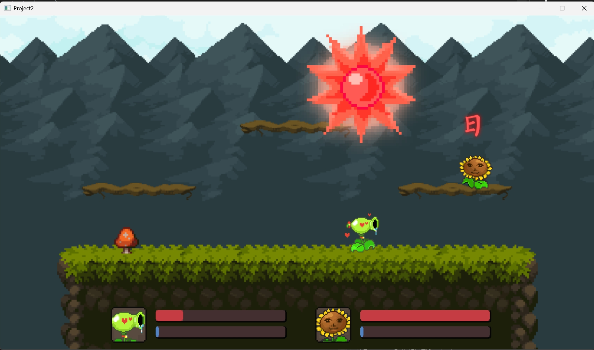

# C++游戏开发 + EasyX
## 《植物明星大乱斗》

> from Voidmatrix in Bilibili  [BV1jx4y1t7eP](https://www.bilibili.com/video/BV1jx4y1t7eP/?spm_id_from=333.1387.collection.video_card.click&vd_source=3e973ec0e34e920793ed03940c43c111)

植物明星大乱斗使一个双人对抗射击游戏。两个主控分别通过移动和发射子弹来击中对方，谁先血量清零或者掉下平台，则输掉游戏。

- player1 wasd-移动 f-射击 G-power
- player2 ↑←↓→-移动 .-射击 /-power

> 开始界面

> 选角色界面

> 游戏界面

### 从项目中学到的东西
- 利用基类和派生类来管理玩家和子弹系统
- 设置一个Camera类 来模拟受击震动
- 利用scene_manager来管理界面的切换，使各个界面之间并不妨碍。减少内存占用。

### 未来想做的
- 增加随机掉落血量，增加玩家一局游戏的时长
- 增加积分系统，一个大局里面分为多个小局，累计多局后再结算双方的胜负关系