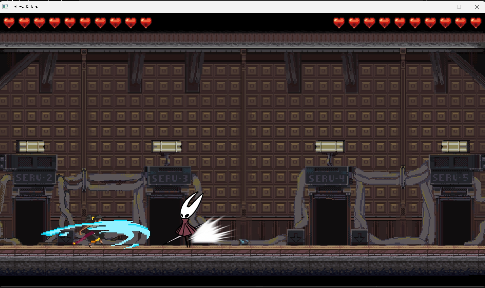
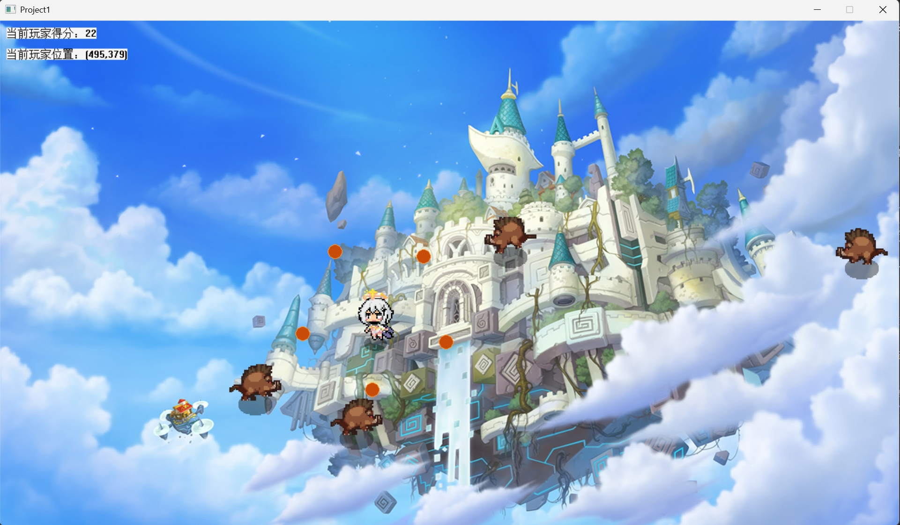

# C++游戏开发 + EasyX
## 《提瓦特幸存者》

> from Voidmatrix in Bilibili  [BV1eM4m1S74K](https://www.bilibili.com/video/BV1eM4m1S74K)

提瓦特幸存者是一个移动(静止)撞击游戏。通过移动提瓦特，能够让悬浮在提瓦特周围的子弹命中不断奔过来的野猪。
之所以说其是静止游戏，是通过多次进行游戏，我们可以发现，在不移动角色的情况下，反而存活的越久，击杀数越多。

> 开始界面

> 游戏界面

### 跟作者比做的优化
- 增加了子弹的升级逻辑，打到的野猪越多，子弹变化越复杂(等级越高)

### 从项目中学到的东西
- 学习了游戏的更新逻辑和渲染逻辑
- 利用EasyX 实现图片的渲染和音效的播放
- 利用button实现scene的切换
- 利用类 随机生成野猪，根据获取角色当前位置，实现野猪的移动方向始终朝向主控角色
    - 与《吃豆人》的敌人追击逻辑类似
- 在外置逻辑中设置帧变换，使游戏更新和渲染更连贯
- 适当的受击特效 or 升级特效 (比如闪烁/缩放等) 会使玩家更有游戏代入感(变强大的感觉)

### 未来想做的
- 子弹升级带来更多炫酷的变化(比如飞剑？)
