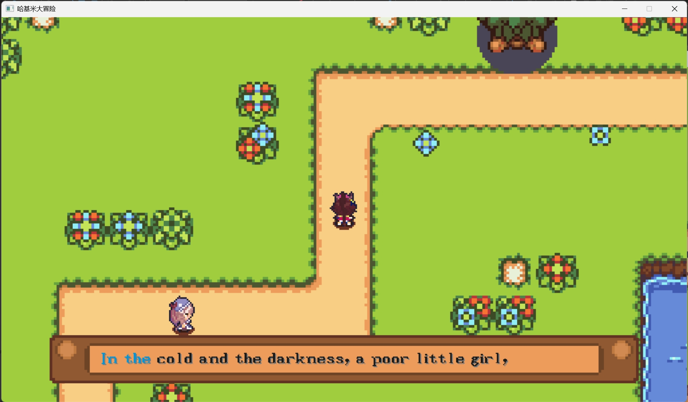
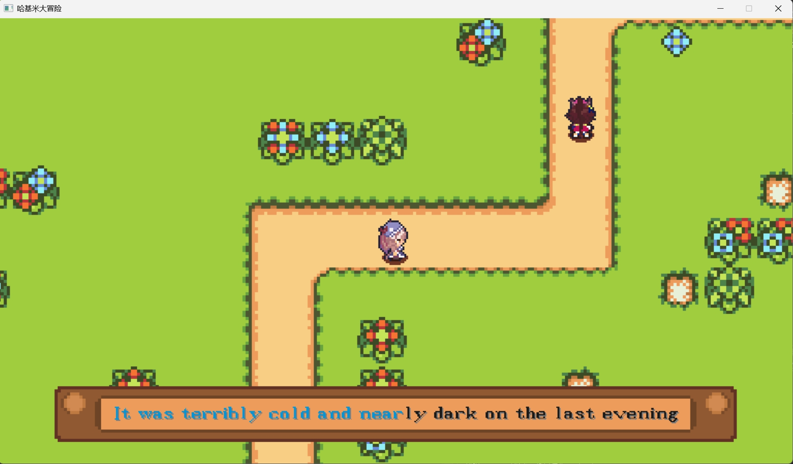
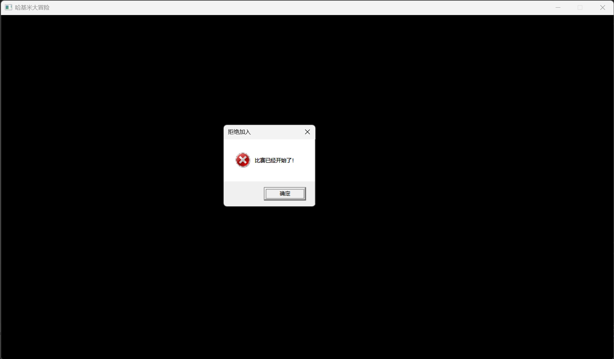

# C++游戏开发 + EasyX
## 《哈基米大冒险》

> from Voidmatrix in Bilibili  [BV1yjsoeREdZ](https://www.bilibili.com/video/BV1yjsoeREdZ)

哈基米大冒险是一个联机双人打字游戏。主要的亮点在于通过同一服务器进行联机游戏。

> Player1 游戏界面

> Player2 游戏界面

> Player3 登陆失败界面

### 从项目中学到的东西
- 通过实际编写联机游戏，对于HTTP服务器的搭建有了更为深刻的理解。
- 设置了两个camera分别聚焦与主控和窗口，使游戏场景更加真实

### 未来想做的
- 利用网络服务器，即使玩家不在同一局域网下，也能联机打游戏。